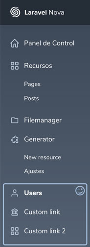

# Nova Link Resource

A custom tool to generate Resource Links in your sidebar. You are able to set a name, link and an icon.



## Installation

You can install the package in to a Laravel app that uses [Nova](https://nova.laravel.com) via composer:


```bash
composer require ericlagarda/novalinkresource
```

Then, register your new link in the `tools` method of the `NovaServiceProvider`.

```php
// in app/Providers/NovaServiceProvider.php


public function tools()
{
    return [
        // ...
        (new NovaLinkResource())
                ->name('Users')
                ->to('/resources/users')
                ->icon('<svg class="sidebar-icon" xmlns="http://www.w3.org/2000/svg"  viewBox="0 0 24 24" width="24" height="24"><path fill="var(--sidebar-icon)" d="M12 12a5 5 0 1 1 0-10 5 5 0 0 1 0 10zm0-2a3 3 0 1 0 0-6 3 3 0 0 0 0 6zm9 11a1 1 0 0 1-2 0v-2a3 3 0 0 0-3-3H8a3 3 0 0 0-3 3v2a1 1 0 0 1-2 0v-2a5 5 0 0 1 5-5h8a5 5 0 0 1 5 5v2z"/></svg>'),

        (new NovaLinkResource())
                ->name('Custom link')
                ->to('/resources/posts/1/edit')
                ->icon('<svg class="sidebar-icon" xmlns="http://www.w3.org/2000/svg" viewBox="0 0 24 24" width="24" height="24"><path fill="var(--sidebar-icon)" d="M19 10v6a2 2 0 0 1 2 2v2a2 2 0 0 1-2 2H5a2 2 0 0 1-2-2v-2c0-1.1.9-2 2-2v-6a2 2 0 0 1-2-2V7a1 1 0 0 1 .55-.9l8-4a1 1 0 0 1 .9 0l8 4A1 1 0 0 1 21 7v1a2 2 0 0 1-2 2zm-6 0h-2v6h2v-6zm4 0h-2v6h2v-6zm-8 0H7v6h2v-6zM5 7.62V8h14v-.38l-7-3.5-7 3.5zM5 18v2h14v-2H5z"/></svg>'),

        (new NovaLinkResource())
                ->name('Custom link 2')
                ->to('/resources/users/4'),
    ];
}
```

## Tool options

* `->name('string')` The name of your link. You can use text and also a translation helper: `__('My link')`
* `->to('link')` The link. You can use any nova link. Default to '/'
* `->icon('svg icon')`Svg string icon. Default to use tool icon.